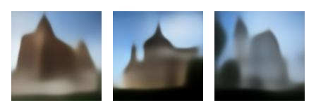
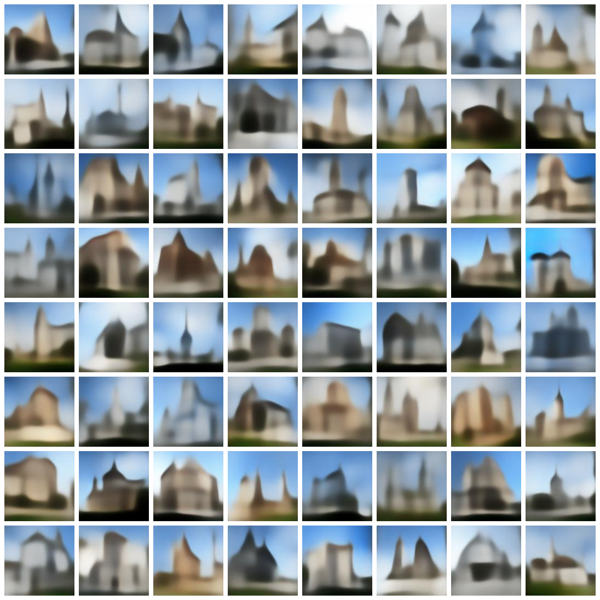
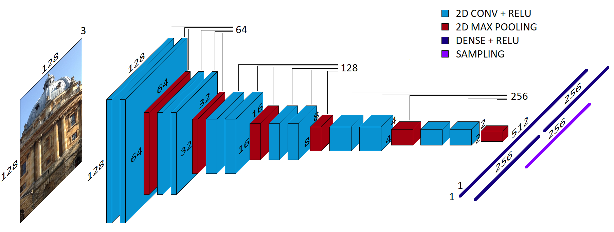
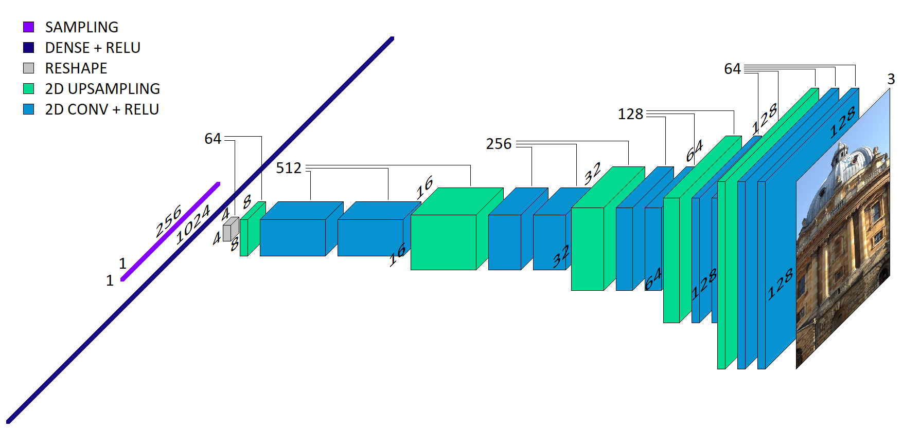

# The Accidental Castle Dreamer

   
 

## Intro

This generative model is a [variational autoencoder](https://en.wikipedia.org/wiki/Variational_autoencoder) (or, more specifically, a [disentangled variational autoencoder](https://openreview.net/pdf?id=Sy2fzU9gl)) meant for the synthesis of architectural imagery. The data it works with is essentially a large aggregate of vacation pictures, and it turns out that people are much more likely to take pictures of castles and churches than of regular office buildings, which in turn skews the model's generation probability landscape, hence the name of the project.  

 

   
  Examples of generated images
 

  
 
The project is still evolving, and the coming weeks may see major changes in architecture and performance. Obtaining a neural network with a significant measure of disentanglement between latent space dimensions representing architectural features (width of the windows, slant of a roof, etc...) represents the ultimate goal of this project. 

If you are unfamiliar with autoencoders (variational, disentangled or otherwise) you may want to peruse the 'Background' section just below. Some more examples of generated images showcasing what the model can learn at this stage can also be found there. If you want to run this code to train a model from scratch and play around with hyperparameters, you can do so following the instructions in the 'Usage' section. 

## Background

#### The Classical Autoencoder

The main idea is to have a model composed of two convolutional neural networks: an encoder and a decoder. The encoder is meant to encode data into a latent space vector (i.e. an arbitrarily-sized 1D array of float values which represent a point in a latent space that has as many dimensions as there are entries in the array), and the decoder is meant to reconstruct the original data from that same vector. However, this makes the neural network far more than a data compression and decompression algorithm. Once successfully trained on a loss function that tracks data reconstruction quality, the decoder would ideally also be able to construct realistic synthetic data from any set of values in the same probability space as the latent space encodings of real data. 

#### The Variational Autoencoder

Now, if the process described above were to take place without any further regularization baked into the model, one would have data reconstruction, but data generation would be extremely unlikely. The network would be incentivized to overfit, assigning different latent space vectors to different training data inputs, but there would be no reason for the space between those vectors to decode into anything meaningful. 

There is a two-part solution to this problem, which gives rise to the variational autoencoder. 

Firstly, the encoder does not just provide a set of deterministically chosen values that constitute the latent space vector. Instead, the encoder provides two values for each of the entries in the latent space vector: a mean, and a variance. Each such set defines a statistical distribution from which one of the values in the latent space vector is then randomly sampled. This ensures that no one piece of data can be assigned to a single latent space vector, it has to be assigned to a distribution. 

However, with this change alone, the variances would grow to be arbitrarily small and the corresponding means to be distant from one another in the latent space, leading to no improvement at all, therefore... 

Secondly, a KL divergence term is added to the loss function. The [Kullback–Leibler divergence](https://en.wikipedia.org/wiki/Kullback%E2%80%93Leibler_divergence) is a measure of the difference between two statistical distributions. The KL divergence between each of the distributions (from which values of the latent space vector are sampled) and the normal distribution is calculated and added to the loss function. This forces the distributions to occupy some of the same space, and thus have some overlap. This greatly increases the likelihood that a random latent space vector would decode to meaningful synthetic data, as long as its values do not stray too far outside a normal distribution. 

This is, in a nutshell, what a variational autoencoder is. 

 

   
  Each of these (admittedly somewhat cherry-picked) 
  images comes from a random normal distribution.
 

#### The Disentangled Variational Autoencoder

A further, very interesting improvement can be brought about in a rather simple way. If the KL divergence loss term is weighed more, in comparison to the reconstruction loss term, then this forces the distributions even closer together. This, in turn, incentivizes the network to get the most bang for its buck with each of the dimensions in the latent space. The best way of achieving that is orthogonality, as that is the only way of minimizing redundancy, and this is how the disentanglement emerges. 

In principle, if each of the latent space dimensions is disentangled, then each will represent an independent underlying feature within the data that the network is trained on. This allows for a very powerful measure of control in the synthesis of new data; a famous example is that of the [smile dimension](https://drek4537l1klr.cloudfront.net/chollet/Figures/08fig11_alt.jpg) in a disentangled variational autoencoder trained on a dataset of faces. Most intriguingly, this implies that the model has a semantic understanding of each of the disentangled features. 

## Network Details

### Data Preparation

All data used to train this network stems from the [Google Landmarks Dataset v2](https://github.com/cvdfoundation/google-landmark), a crowdsourced collection of 5 million pictures of human-made and natural landmarks. 

Images depicting architecture were selected from the original dataset by two ensemble classifiers. The first model discerns whether a picture is of a building or not, and the second discerns whether an image of a building is suitable or not (this latter task is admittedly vague and based on a set of arbitrary criteria such as whether a photo is blurry, whether a significant portion of the architecture is blocked by a vehicle, or whether the photo contains enough features of a building to infer its overall structure). 

Each ensemble model is composed of three identical networks that were trained independently of one another. The architecture of the individual networks is always an imagenet-pretrained Densenet201's convolutional base with three dense layers added at the end, trained on a smaller, painstakingly hand-annotated dataset (approximately 12,000 pictures in total). The smaller datasets were fed to a keras image data generator for data augmentation. Passing the original Google Landmarks Dataset v2 through both ensemble classifiers yields almost 400,000 images which are then used to train the variational autoencoder. 

All pertinent scripts are in the 'transfer_learning' folder. 

(I am yet to make the hand-annotated datasets available. However, if you'd like to use my pre-trained models, you can just run deploy.py) 

### Loss Function

The overall loss function is composed of 3 independent components: 
- a simple reconstruction loss - the sum of squared errors between all corresponding values of the input and output tensors. 
- a KL-divergence loss function to incentivise the latent space distributions to occupy the same space, multiplied by a hyperparameter (beta).  
- a perceptual loss function (which I have only recently begun tinkering with) hinging on a pre-trained computer vision model. The variational autoencoder's input and output images are passed through the pre-trained network, the activity of an early convolutional (or pooling) layer is compared for the two images, and the absolute error is calculated for the corresponding entries. This term is likewise multiplied by a hyperparameter (gamma).  

### Architecture

The encoder is built out of six blocks, each of which is comprised of two 2D convolutional layers and one 2D max pooling layer. The last max pooling layer is followed by a densely connected layer, which feeds into two further densely connected layers with the same size as the model's latent space dimension. One of these two layers holds the means, the other the variances, and they are followed by the sampling layer, which outputs the entries for the latent space vectors, sampled from the distributions defined by means and variances. 

   
 

The decoder takes the output of the sampling layer (or any one-dimensional array of the appropriate size), and feeds it into a densely connected layer the output of which is then reshaped so that it may be followed by a convolutional layer. The rest of the decoder is built out of five blocks which are comprised by a 2D upsampling layer followed by two 2D convolutional layers. The last block is followed by a last convolutional layer which outputs the reconstructed (or generated) image. 

   
 

### Monitoring
The reconstruction and perceptual loss terms' values alone cannot provide a detailed insight in the network's performance (mse is very forgiving of blurry images and perceptual loss functions are frequently very forgiving of visual artifacts). The project contains a 'to_reconstruct' folder with 12 pictures in it. During training, with a frequency of once every 1000 steps (can be changed in the hyperparameters file) the network's performance is monitored by saving reconstruction attempts of those 12 pictures in a local 'monitor_reconstruction' folder - this is what the gif above is based on. 
 
Analogously, 12 random latent space vectors from a normal distribution are generated at the start of training, and every 1000 steps they are decoded into images and saved in a local 'monitor_generation' folder. Once training and testing are concluded, 100 random latent space vectors are decoded into images and saved in a local 'demo_{model_name}' folder. 

### Hardware

This code was developed and tested on a NVIDIA GeForce RTX 3070 Laptop GPU.

## Requirements

python 3.x 
[Conda](https://docs.conda.io/en/latest/miniconda.html) (not strictly a requirement, but is likely to make running this project a great deal easier) 
Cuda drivers (necessary if you want to run this code on a GPU) 
tensorflow-gpu (again, necessary to run this on a GPU, otherwise regular tensorflow will do) 
numpy 
wget 
PIL

## Usage

With [Conda](https://docs.conda.io/en/latest/miniconda.html): 
(should 'conda' not be recognized in the terminal, the following commands will also work in the conda/miniconda prompt) 
`conda install -c anaconda cudatoolkit` 
`git clone https://github.com/E-Fumi/TheAccidentalCastleDreamer` 
`cd TheAccidentalCastleDreamer` 
`conda env create -f environment.yml` 
`conda activate VAE` 
`python main.py` 

Without Conda: 
(down this path you'll have to figure out the GPU side of things yourself, theoretically you could also run this code on a CPU, but it would be excruciatingly slow) 
`git clone https://github.com/E-Fumi/TheAccidentalCastleDreamer` 
`cd TheAccidentalCastleDreamer` 
`pip install -r requirements.txt` 
`python main.py` 

