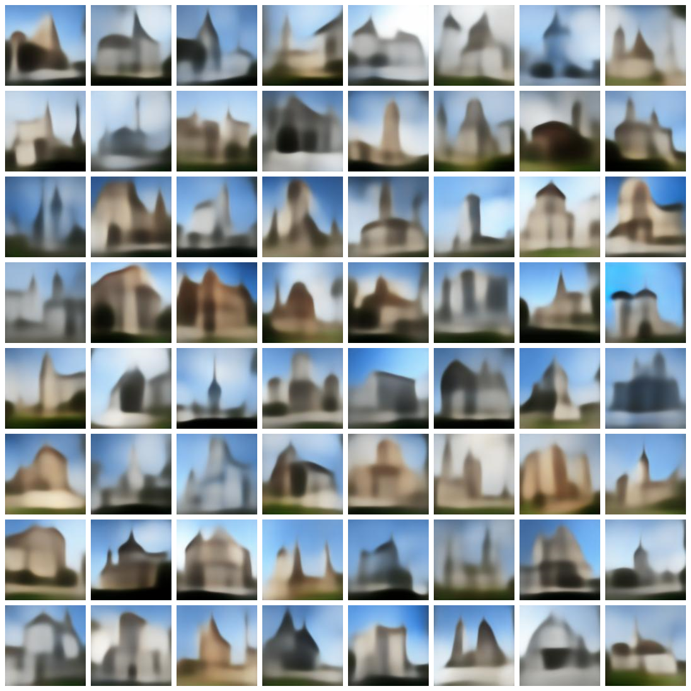

# The Accidental Castle Dreamer

#### First things first

This is a work in progress, and while the base of it is (passably) solid, various details are going to change in the coming weeks, hopefully bringing with them improvements in performance.

## Intro

This generative model is a [variational autoencoder](https://en.wikipedia.org/wiki/Variational_autoencoder) (or, more specifically, a [disentangled variational autoencoder](https://openreview.net/pdf?id=Sy2fzU9gl)) meant for the synthesis of architectural imagery. The data it works with is basically a large aggregation of vacation pictures, and it turns out that people are much more likely to take pictures of castles and churches than of regular office buildings, which in turn skews the model's reconstruction's probability landscape, hence the name of the project.  

### The Classical Autoencoder

The main idea is to have a neural network composed of two convolutional neural networks: an encoder and a decoder. The encoder is meant to encode data into a latent space vector (i.e. an arbitrarily-sized 1D array of float values), and the decoder is meant to reconstruct the original data from that same vector. However, this makes the neural network far more than a data compression and decompression algorithm. Once successfully trained on a loss function that tracks data reconstruction, the decoder would ideally also be able to construct realistic synthetic data from any set of values in the same probability space as the latent space encodings for real data. 

 

   
  Each of these (admittedly somewhat cherrypicked) 
  images comes from a random normal distribution.
 

 

### The Variational Autoencoder

Now, if the process described above were to take place without any further regularization baked into the model, one would have a classical autoencoder (not variational). The issue with it is that one would get data reconstruction, but data generation would be extremely unlikely. The network would be incentivized to overfit, assigning different latent space vectors to different training data inputs, but the space between those vectors would not decode to anything meaningful. 

There is a two-part solution to this problem, which gives rise to the variational autoencoder. 

Firstly, the encoder does not just provide a set of deterministically chosen values that constitute the latent space vector. Instead, the encoder provides two values for each of the entries in the latent space vector: a mean, and a standard deviation. Each such set defines a statistical distribution from which one of the values in the latent space vector is then randomly sampled. This ensures that no one piece of data can be assigned to a single latent space vector, it has to be assigned to a distribution. 

However, with this change alone, the standard deviations would grow to be arbitrarily small and the corresponding means to be distant from one another in the latent space, leading to no improvement at all, therefore... 

Secondly, a KL divergence term is added to the loss function. The Kullback–Leibler divergence is a measure of the difference between two statistical distributions. The KL divergence between each of the distributions (from which values of the latent space vector are sampled) and the normal distribution is calculated and added to the loss function. This forces the distributions to occupy some of the same space, and thus have some overlap. This greatly increases the likelihood that a random latent space vector would decode to meaningful synthetic data, as long as its values do not stray too far outside a normal distribution. 

This is, in a nutshell, what a variational autoencoder is. 

### The Disentangled Variational Autoencoder

A further, very interesting improvement can be brought about in a rather simple way. If the KL divergence loss term is weighted more, in comparison to the reconstruction loss term, then this forces the distributions even closer together. This incentivizes the network to get the most bang for its buck with each of the dimensions in the latent space (and perhaps even having a few unused dimensions that bear no relevance for the network's output and that are set equal to a normal distribution so as to not contribute to the KL divergence loss term). The best way of acheiving that is orthogonality, and this is where the disentanglement comes in. In principle, if each of the latent space dimensions is disentangled, then each will represent an independent underlying feature within the data that the network is trained on [smile dimension](https://drek4537l1klr.cloudfront.net/chollet/Figures/08fig11_alt.jpg)  

## Network Details

### Data Preparation

All data used to train this network stems from the Google Landmarks Dataset v2, a crowdsourced collection of 5 million pictures of human-made and natural landmarks. 

Images depicting architecture were selected from the original dataset by two ensemble classifiers. The first model discerns whether a picture is of a building or not, and the second discerns whether an image of a building is suitable or not (this latter task is admittedly vague and based on a set of arbitrary criteria such as whether a photo is blurry, whether a significant portion of the architecture is blocked by a vehicle, or whether the photo contains enough features of a building to infer its overall structure). 

Each ensemble model is composed of three identical networks that were trained independently of one another. The architecture of the individual networks is always an imagenet-pretrained Densenet201's convolutional base with three dense layers added at the end, trained on a smaller, painstakingly hand-annotated dataset (approximately 12,000 pictures in total). The smaller datasets were fed to a keras image data generator for data augmentation. Passing the original Google Landmarks Dataset v2 through both ensemble classifiers yields almost 400,000 images which are then used to train the variational autoencoder. 

All pertinent scripts are in the 'transfer_learning' folder. 

### Losses

The overall loss function is composed of 3 independent components: 
- a simple reconstruction loss equal to the mean squared error between all corresponding values of the input and output tensors. 
- a KL-divergence loss function to incentivise the latent space distributions to occupy the same space.  
- a perceptual loss function (which I have only recently began tinkering with) hinging on a pre-trained network. 

### Architecture

Placeholder text.

### Monitoring

Placeholder text.

### Hardware

This code was developed and tested on a NVIDIA GeForce RTX 3070 Laptop GPU.

## Requirements

python 3.x 
[Conda](https://docs.conda.io/en/latest/miniconda.html) (not strictly a requirement, but is likely to make running this project a great deal easier) 
Cuda drivers (necessary if you want to run this code on a GPU) 
tensorflow-gpu (again, necessary to run this on a GPU, otherwise regular tensorflow will do) 
numpy 
wget 
PIL

## Usage

With [Conda](https://docs.conda.io/en/latest/miniconda.html): 
(should 'conda' not be recognized in the terminal, the following commands will also work in the conda/miniconda prompt) 
`conda install -c anaconda cudatoolkit` 
`git clone https://github.com/E-Fumi/TheAccidentalCastleDreamer` 
`cd TheAccidentalCastleDreamer` 
`conda env create -f environment.yml` 
`conda activate VAE` 
`python main.py` 

Without Conda: 
(down this path you'll have to figure out the GPU side of things yourself, theoretically you could also run this code on a CPU, but it would be excruciatingly slow) 
`git clone https://github.com/E-Fumi/TheAccidentalCastleDreamer` 
`cd TheAccidentalCastleDreamer` 
`pip install -r requirements.txt` 
`python main.py` 

